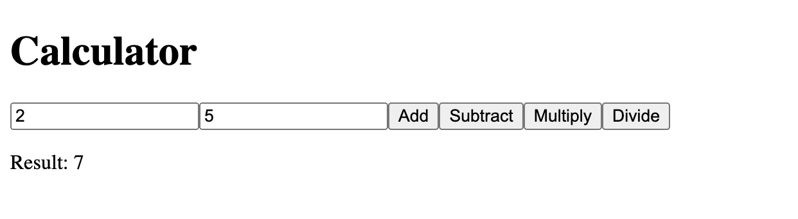

## 初始化项目，实现一个计算器，支持加减乘除

prompt 提示词

```
扮演一个前端工程师。擅长 typescript 和 rust、wasm

在一个 git 项目中：
根目录创建rust包，包名为“calculator_lib, 实现一个计算器，支持加减乘除
将这个包编译成 wasm，编译的方法写成 shell 脚本
根目录创建nextjs项目，项目名为“web”, 使用 ts 实现计算器的 UI，并且调用 wasm 执行计算
```

由于每一次提交会返回不一样的结果，这里提供一个示例结果。
[提交链接](https://chat.openai.com/share/4d808faf-a3b3-41a3-b019-7f313c19968d)

最后运行的页面效果

